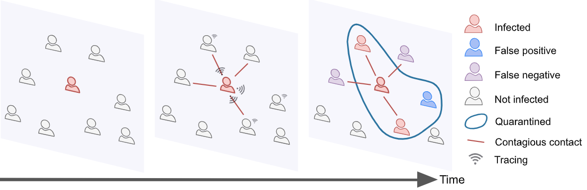

# Digital Proximity Tracing in the COVID-19 Pandemic on Empirical Contact Networks

### Read the [paper](covid_tracing_and_isolation.pdf).

### Abstract:

Digital contact tracing is increasingly considered as a tool to control infectious disease outbreaks. 
As part of a broader test, trace, isolate, and quarantine strategy, digital contract tracing apps have been proposedto alleviate lock-downs, and to return societies to a more normal situation in the ongoing COVID-19 crisis.
Early work evaluating digital contact tracing did not consider important features and heterogeneities present in real-worldcontact patterns which impact epidemic dynamics.
Here,  we fill this gap by considering a modeling frameworkinformed by empirical high-resolution contact data to analyze the impact of digital contact tracing apps in the COVID-19 pandemic. 
We investigate how well contact tracing apps, coupled with the quarantine of identified contacts, canmitigate the spread of COVID-19 in realistic scenarios such as a university campus, a workplace, or a high school.
We find that restrictive policies are more effective in confining the epidemics but come at the cost of quarantining alarge part of the population. 
It is possible to avoid this effect by considering less strict policies, which only considercontacts with longer exposure and at shorter distance to be at risk. 
Our results also show that isolation and tracingcan help keep re-emerging outbreaks under control provided that hygiene and social distancing measures limit the reproductive number to 1.5.  Moreover, we confirm that a high level of app adoption is crucial to make digital contacttracing an effective measure. 
Our results may inform app-based contact tracing efforts currently being implementedacross several countries worldwide

### Contacts: 
For any question or comment, feel free to drop us an [email](mailto:digital_contact_tracing@fbk.eu).

